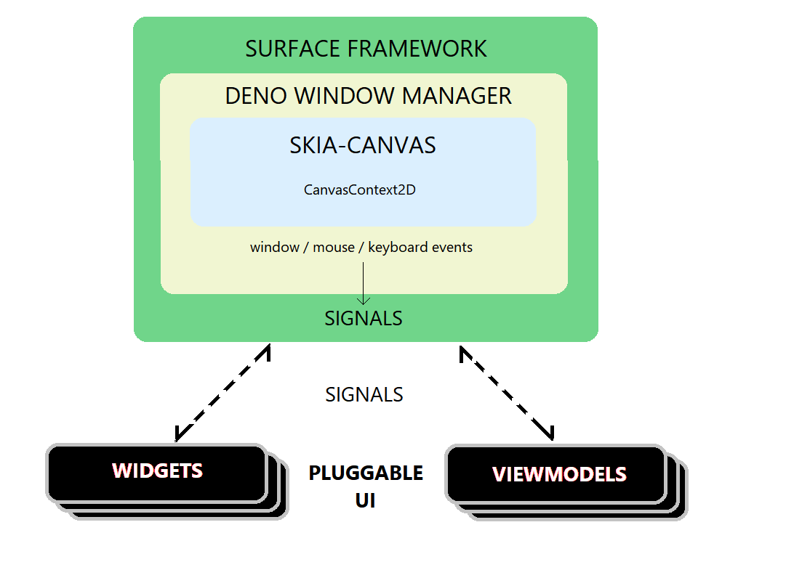
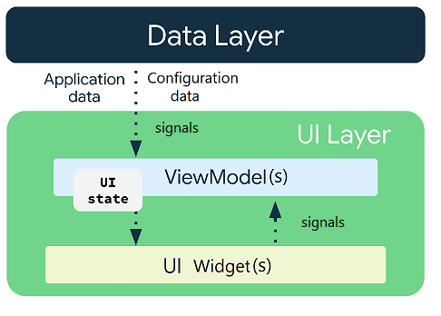

# DWM_GUI Framework  
## DENO DESKTOP GUI  

 
 
## Warning: POC-WIP project
The purpose of this Proof Of Concept project is to test the validity of a _Deno-Window-Manager Graphical-User-Interface_ framework; proving that the proposed framework can work in real life examples.  This is a _Work-In-Progress_ project, and is in no way ready for production. You should expect constant-change while I play with the design and implementation.

 

No Browser!  No WebView! Just a cross-platform desktop window!
  
This experimental UI framework wraps both Deno Window Manager and skia-canvas.    
https://github.com/deno-windowing/dwm    
https://github.com/DjDeveloperr/skia_canvas 
 
 

## MVVM-EA

This framework implements a modified MVVM-Event-Aggregation pattern.   
The architecture of this framework follows the Chrome-Skia model very closely.   
We compose what is to be rendered, and allow the Skia-canvas to do its work.   

The following table illustrates the close relationships to the Chrome-Skia model linked below.    
Where:
 | DWM-GUI | Chrome-Skia |
 | :--- | :--- |
 | DWM | rootWindowHost |
 | window | rootWindow |
 | EventBus | Chrome-mojo |
 | Views/Viewmodels | Elements | 

As you can see, this DWM-GUI framework is almost a direct match to the Chrome-Skia model.  
### See: [Chrome-Skia](.media/Chrome-Skia.md)

 

Plain Old Deno Typscript! -- DOM not spoken here!

This MVVM-Event-Aggregation pattern is used by Google(Dart-Flutter, Android-Kotlin), Apple(Swift-MVVM), and of course Microsoft(WFP-XAML).  
  
NOTE: This model would **NOT** be a good fit for a Browser application!    
For this custom canvas-GUI, its an extremely very good fit. 

 

## UDF in MVVM-EA:
When state flows down and events flow up, it's called a unidirectional data flow (UDF).
 
 
  * The ViewModel holds and exposes the state to be consumed by the View. The View state is application data transformed by the ViewModel.
  * The View notifies ViewModel of user events.
  * The ViewModel handles the user actions and updates the state.
  * The updated state is fed back to the View to render.
  * The above is repeated for any event that causes a mutation of state.
  
The UI logic, particularly when it involves canvas-renderd-Views, should live in the View, not in the ViewModel.    
This separation lets the View;(UI) do exactly what its name implies: display information by observing state changes, and relay user intent by passing user-initiated-events on to ViewModel(s).
   
 

## Text editing on a canvas! 
The TextArea example app in the examples repo, demonstrates the new DWM-GUI **TextArea** View and its associated ViewModels. 

This TextArea component is still in active development. 
It currently implements:
  - line breaks on word bounderies
  - full keyboard text editing
  - cursor movement and multi-line text selection
  
Yet todo:
  - scrolling - scrollbars
  - mouse selection
   
 

Copyright 2022-2023, Nick D. Hrones, All rights are reserved.